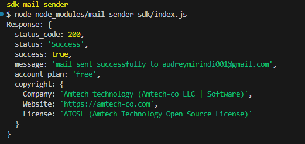
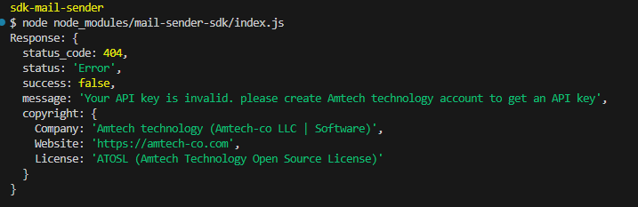

**Amtech Mail Sender SDK Documentation**
======================================

**Overview**
---------
The Mail Sender *SDK* provides an easy way to send emails through an *API*, utilizing Node.js and browser environments. The SDK abstracts the complexity of sending emails and handles API calls to send email messages in both server-side (Node.js) and client-side (browser) applications. you need to send them through *HTTPS* or at least *HTTP* it means, run your frontend code with a live server in *VSCODE* to run it on browser.

Key Features:
- **Node.js & Browser Support**: Works in both environments.
- **API Integration**: Seamlessly connects to the mail sending API.
- **Error Handling**: Provides clear error messages.
- **Cross-Platform**: Automatically detects the environment and adapts the fetch API accordingly.

**Installation**
------------
1. *Install the SDK*:
   
sh:
   `npm install mail-sender-sdk`

Create an account to `https://www.amtech-co.com` to get a free APIKEY

1. *Usage in Node.js*:
js:
 ```
import { sendEmail } from 'mail-sender-sdk';

const apiKey = 'your-sendgrid-api-key';
const from = 'sender@example.com';
const to = 'recipient@example.com';
const emailCC = 'exemple@domain.com'; // required. set the company email adresse if don't what to put here!
const emailBCC = 'exemple@domain.com'; // required. set the company email adresse if don't what to put here!
const attachment = ''; // the attachment is not supported yet. leave it blank until the update
const attachment_name = ''; // leave this blank as well
const subject = 'Test Email';
const body = 'This is a test email body.';
const companyName = 'Your Company';

sendEmail(from, to, emailCC, emailBCC, attachment, attachment_name, companyName, subject, body, apiKey)
.then(response => {
    console.log('Email sent successfully!', response);
})
.catch(error => {
    console.error('Error sending email:', error);
});
```

1. Usage in the Browser:
   
html:
`<script type="module" src='index.js'></script>`

into the index.js file:
   ```
import { sendEmail } from './path/to/index.js';

const apiKey = 'your-sendgrid-api-key';
const from = 'sender@example.com';
const to = 'recipient@example.com';
const emailCC = 'exemple@domain.com'; // required. set the company email adresse if don't what to put here!
const emailBCC = 'exemple@domain.com'; // required. set the company email adresse if don't what to put here!
const attachment = ''; // the attachment is not supported yet. leave it blank until the update
const attachment_name = ''; // leave this blank as well
const subject = 'Test Email';
const body = 'This is a test email body.';
const companyName = 'Your Company';

sendEmail(from, to, emailCC, emailBCC, attachment, attachment_name, companyName, subject, body, apiKey)
.then(response => {
    console.log('Email sent successfully!', response);
})
.catch(error => {
    console.error('Error sending email:', error);
});
```

**API Usage**
---------
Function: `sendEmail(from, to, companyName, subject, body, apiKey)`

**Parameters**:
- **from (String)**: Sender's email address.
- **to (String)**: Recipient's email address.
- **companyName (String)**: Name of the company sending the email.
- **subject (String)**: Subject of the email.
- **body (String)**: Email content.
- **apiKey (String)**: API key for authentication.

**Returns**:
- A promise that resolves with the API response on success or rejects with an error message.

**Error Handling**
--------------
- *CORS Issues*: Ensure API server allows browser-origin requests.
- *Network Errors*: The SDK will reject the promise if the network fails.
- *Invalid API Key*: Ensure your API key is valid.

**Responses**:
- *Success message exemple*:<br>
  <br>
- *Failed message exemple*:<br>
  


**FAQ**
---
**Q1**: What if my email fails to send?
- The SDK provides an error message for troubleshooting. Check API credentials and network settings.

**Q2**: Can I use this SDK with other email providers?
- Yes, as long as they support HTTP API requests.

**Q3**: Is there a way to check if an email was sent?
- The promise resolves with the response object. Check the response data.

**Copyright & Credits**
-------------------
© 2025 Amtech Technology (Amtech-co LLC | Software). All rights reserved.

